
# final-project-skeleton

    * Team Name: Water
    * Team Members: Haichao Zhao, Zeng Li, Chi Zong
    * Github Repository URL: https://github.com/upenn-embedded/final-project-electronic-pet
    * Github Pages Website URL: (https://haichao-z.github.io/)
    * Description of hardware: ATmega328PB, Laptop, HS90R, Gesture Sensor, Adafruit ItsyBitsy 32u4. 

## Final Project Report

Don't forget to make the GitHub pages public website!
If you’ve never made a Github pages website before, you can follow this webpage (though, substitute your final project repository for the Github username one in the quickstart guide):  <https://docs.github.com/en/pages/quickstart>

### 1. Video

The link of final demo video:[final demo](https://drive.google.com/file/d/1fFg5g0fT90FGrsQ2s7JU2HYs9j5ZzdxQ/view?usp=drive_link)

### 2. Images

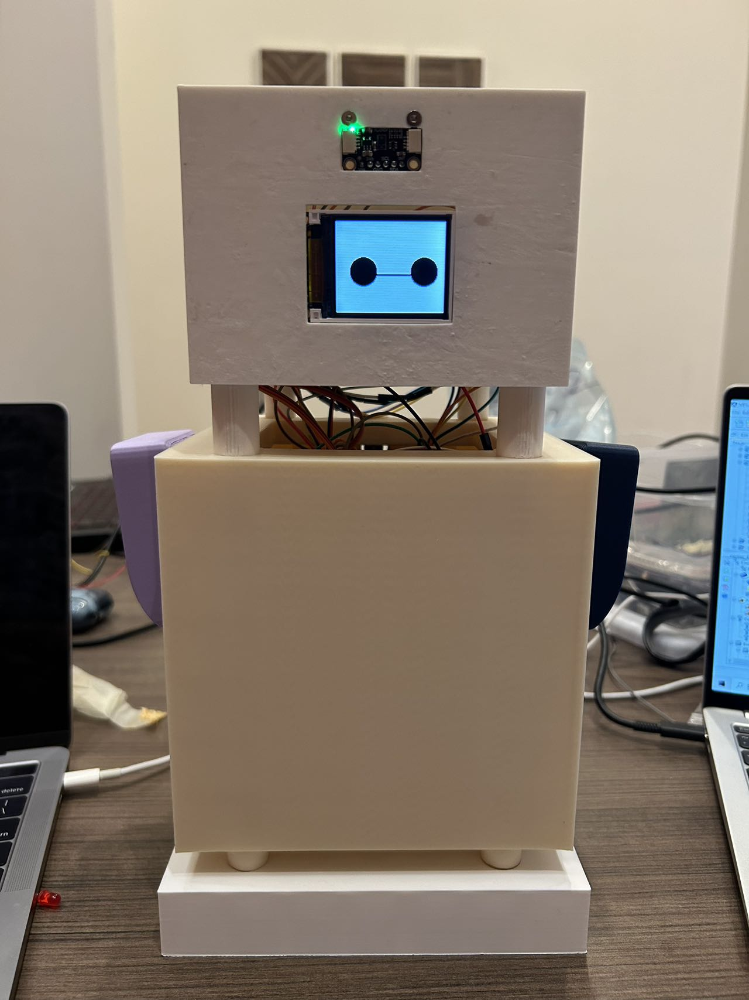

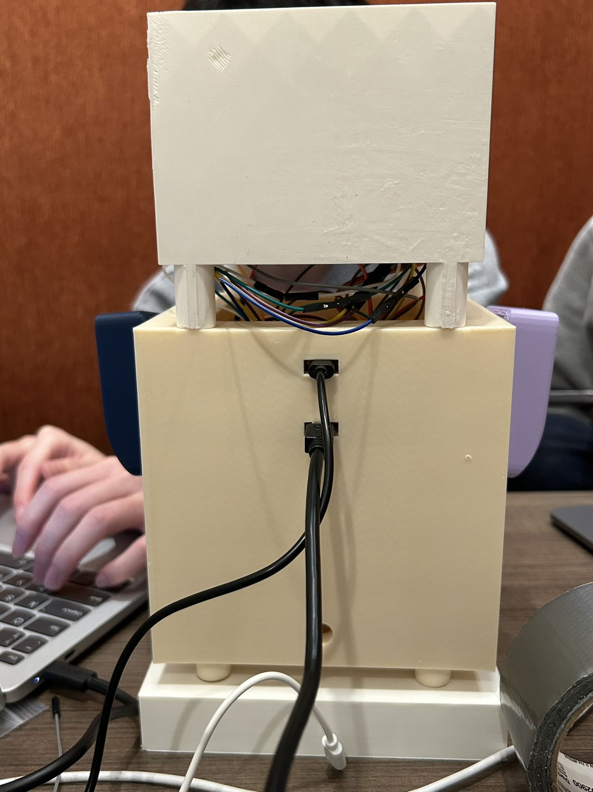

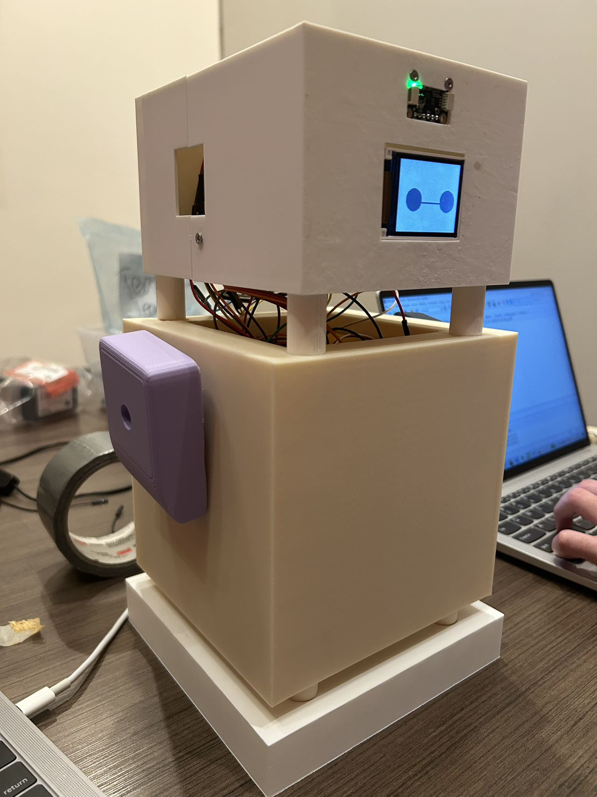

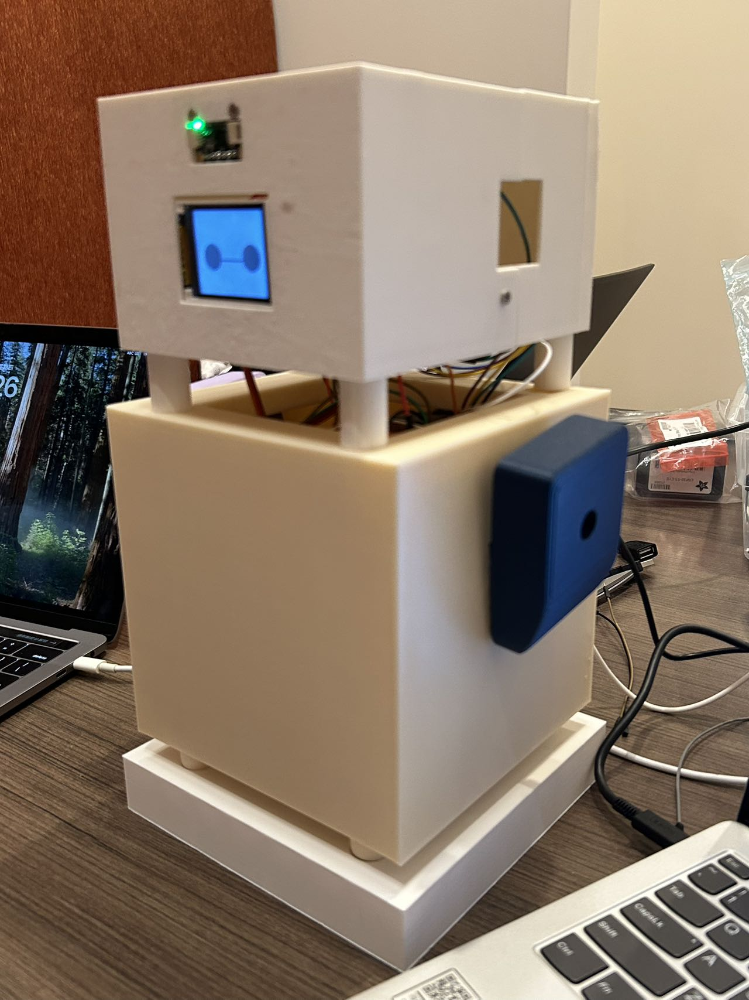

### 3. Results

This design is an electronic pet based on the ATmega328PB microcontroller. It connects to a personal computer, making it more enjoyable for users to operate the computer.

The electronic pet uses a gesture sensor to recognize user gestures and controls an HID module to execute corresponding commands on the computer. Additionally, it interacts with users through an LCD display and controls two servo motors to move its arms. It also features a health reminder function, making a sound through a buzzer to prompt users to take a break after a certain period of use.

#### 3.1 Software Requirements Specification (SRS) Results

- SRS 01

> The system shall do the task of screenshot when the gesture sensor detects the moving up hand.

The link of video:[V1](https://drive.google.com/file/d/1TQ74wxHXDFXD1CHwbd6EwBzB4ZQi_P0l/view?usp=drive_link)

- SRS 02

> The system shall launch google Chrome when the gesture sensor detects the moving down hand.

The link of video:[V2](https://drive.google.com/file/d/15U3rTrGH9UXb9LglVdpfGtx9CsIAb5-i/view?usp=drive_link)

- SRS 03

> The system shall switch PC screen when the gesture sensor detects the moving right hand.

The link of video:[V3](https://drive.google.com/file/d/1UDsRsmasVPHxLKSFp67oaCFAM_eC0QRG/view?usp=drive_link)

- SRS 04

> The system shall open the task manager when the gesture sensor detects the moving left hand.

The link of video:[V4](https://drive.google.com/file/d/1Th-9U5OhTPvPvhbq1ClqkLB-K3qjjyBS/view?usp=drive_link)

- SRS 05

> The LCD shall display down arrow.

- SRS 06

> The LCD shall display up arrow.

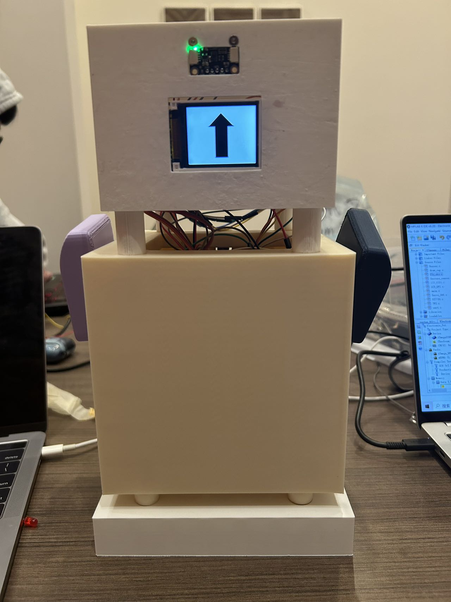

- SRS 07

> The LCD shall display right arrow.

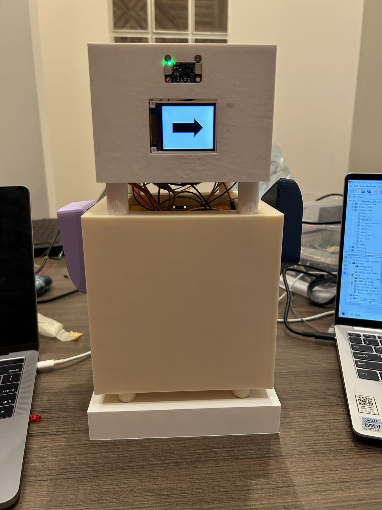

- SRS 08

> The LCD shall display left arrow.

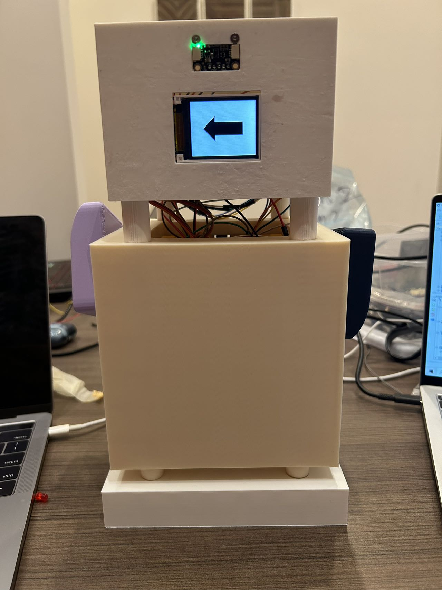

- SRS 09

> The LCD shall display animations when the system is in idle state.

- SRS 10

> The LCD shall display animated responses to user gestures.

The link of video: [V5](https://drive.google.com/file/d/1zAT80AlSraw1GIxeyPhh8TyBq5VaB7uk/view?usp=drive_link).

- SRS 11

> The LCD shall display wellness reminder animations. And in this case, we set time period is 40s to improve test efficiency. To be specific, buzzer shall beep within this time period and a wellness reminder animation will be displayed.

The link of video: [V6](https://drive.google.com/file/d/1z9grR9t-mS1oIDZwXEvzrdmR-REgMCMR/view?usp=drive_link).

- SRS 12

> When the gesture sensor detects a hand movement to left, the left arm of the robot shall raise upwards and lowered after a period of time. The right arm shall stay still.

The link of video: [V7](https://drive.google.com/file/d/1Th-9U5OhTPvPvhbq1ClqkLB-K3qjjyBS/view?usp=drive_link).

- SRS 13

> When the gesture sensor detects a hand movement to right, the right arm of the robot shall raise upwards and lowered after a period of time. The left arm shall stay still.

The link of video: [V8](https://drive.google.com/file/d/1UDsRsmasVPHxLKSFp67oaCFAM_eC0QRG/view?usp=drive_link).

- SRS 14

> When the gesture sensor detects a hand movement to up, both the left arm and the right arm of the robot shall raise upwards for a long distance and lowered after a period of time.

The link of video: [V9](https://drive.google.com/file/d/1TQ74wxHXDFXD1CHwbd6EwBzB4ZQi_P0l/view?usp=drive_link).

- SRS 15

> When the gesture sensor detects a hand movement to down, both the left arm and the right arm of the robot shall raise upwards for a short distance and lowered after a period of time.

The link of video: [V10](https://drive.google.com/file/d/15U3rTrGH9UXb9LglVdpfGtx9CsIAb5-i/view?usp=drive_link).

#### 3.2 Hardware Requirements Specification (HRS) Results

- HRS 01

> The electronic pet shall be connected to the PC through a wired connection, which is used for both power supply and USB communication.

The link of video: [HRS01](https://drive.google.com/file/d/1zAT80AlSraw1GIxeyPhh8TyBq5VaB7uk/view?usp=drive_link).

- HRS 02

> A gesture sensor shall communicates with PC via I2C protocal.

- HRS 03

> A gesture sensor shall recognize four gestures: up, down, right, left.

- HRS 04

> A 160x128 resolution LCD shall be used to show the real time, the recognized gesture and wellness reminder.

- HRS 05

> The LCD communicates with MCU via SPI protoccal.

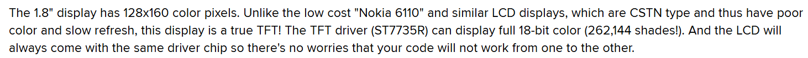

- HRS 06

> Two motors shall be driven by the signal with 50Hz frequency. Motors shall stop under 1.5ms pulse, move clockwisely under 2ms pulse and move counter-clockwisely under 1ms pulse.

- HRS 07

> An HID board shall be used to emulate a PC keyboard, allowing it to send commands to PC via USB D+/D- differential signals.

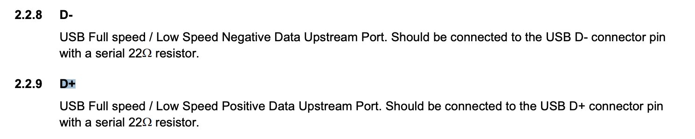

### 4. Conclusion

In this project, we initially planned to use a camera for gesture recognition. However, considering the difficulty of recognition and the processing capacity of the MCU, we decided to use a gesture sensor for gesture recognition. We also incorporated servo motors to enhance the interactivity of the electronic pet.

During the development process, we became more proficient in applying concepts such as interrupts, PWM, SPI, and I2C. When facing challenges, we improved our developing skills by consulting resources and datasheets to find solutions.

For further improvements, we could add more gesture commands, refine the precision of the gesture sensor and servo motors, and program the buzzer to play music.

Lastly, a lot of thanks to the course instructor Nicholas McGill-Gardner, and our "account manager" Yining Xia, for their guidance and support!

## MVP Demo

### 1. System Block Diagram

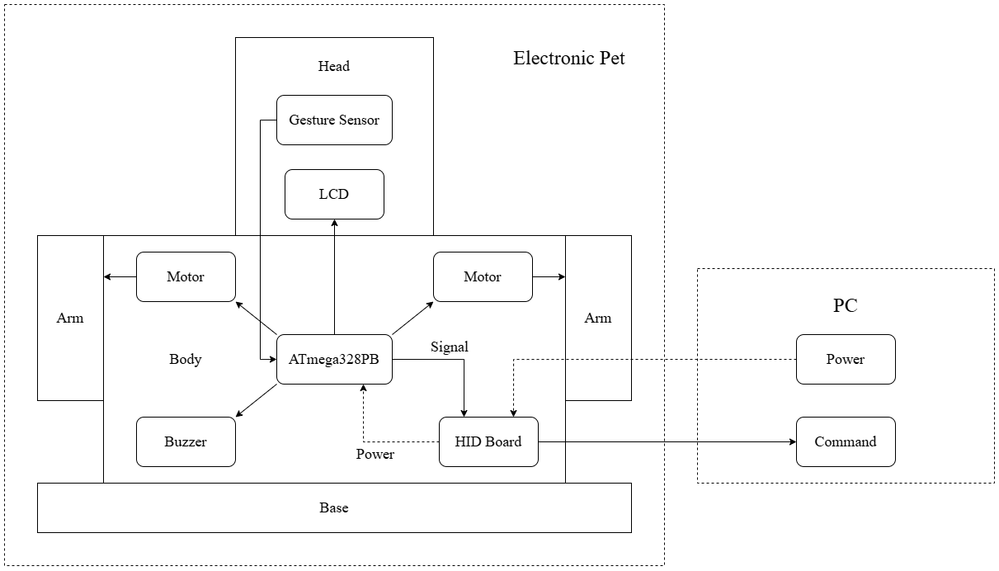

### 2. Hardware Implementation

1. **MCU**: The ATmega328PB MCU controls all other modules and provides power to them.

2. **Gesture sensor**: The gesture sensor utilizes four directional photodiodes to sense reflected IR energy (sourced by the integrated LED) to convert a physical motion to a digital information.

3. **LCD screen**: The LCD screen displays animations to enhance interaction between users and the electronic pet.

4. **Servo motor**: Two servo motors control the raising and lowering of the electronic pet's arms (it can dance!).

5. **Buzzer**: The buzzer is used for notifications during successful interactions. The driving circuit of the buzzer includes a transistor and a resistor.

6. **HID board**: Through the HID board, the electronic pet can send commands to the computer to perform certain operations.

### 3. Firmware Implementation

1. **Gesture sensor**:

- Communicates with the MCU via I2C.

- Recognizes gestures moving in four directions: up, down, left, and right.

> Different movement directions cause the four directional photodiodes to receive different reflected IR energy, which is then converted into digital signals stored in registers. By evaluating the values from the four directions, the movement direction of the gesture can be identified.

2. **LCD screen**:

- Communicates with the MCU via SPI.

- Detection Prompt: When a gesture movement is successfully detected, it displays an arrow corresponding to the movement direction (up, down, left, or right).

- Health Reminder: When the user has been using the device for a certain time, it shows a water cup icon to remind them to drink water and take a break.

- Idle State: Displays the electronic pet’s cute eyes.

3. **Servo motor**

- Set PD0 and PD1 as outputs

- Using timer 3 and timer 4, set the Fast PWM mode and 64 prescaler and set the value of ICR to 4999, which outputs 50Hz frequency. FS90R servo motors need to operate under 50Hz frequency.

- According to the datasheet, FS90R servo rotates clockwisely when it works under 2ms. It stops when it works under 1.5ms and it rotates counter-clockwisely when it works under 1ms. Therefore, OCnA (n=3 & 4) is set to 250,365 and 499 for control the rotation of servo.

- Owing to the fact that FS90R servo is a continuous servo, the position of the servo is controlled by the time it rotates. Thus, delay function is used in this part.

4. **Buzzer**

- Set PD3 as an output

- Using timer 2, set Fast PWM mode to control the volumn of buzzer and use timer prescaler to adjust the frequency of Buzzer to nearly 1kHz, which is comfortable for users to hear.

- Enable the overflow for timer 2. And after each time overflows, a preset time flag will be added one. Only when it gets the preset value (the time we expect to beep), the buzzer will beep for a second, which is operated in the main function.

5. **HID board**

- Communicates with PC via USB D+/D- differential signals, given flag signals received from MCU.

- When the recognized gesture is down, HID board will open google Chrome application installed in the MAC.

- When the recognized gesture is right, HID board will switch the screen of the PC.

### 4. Software Requirements Specification (SRS)

- SRS 01 **[Made it!]**

> The system shall do the task of screenshot when the gesture sensor detects the moving up hand.

The link of video display is:[V1](https://drive.google.com/file/d/1fkpihpQ44amjBUFiKkw18MEKBuSZ3KU-/view?usp=drive_link)

- SRS 02 **[Made it!]**

> The system shall launch google Chrome when the gesture sensor detects the moving down hand.

The link of video display is:[V2](https://drive.google.com/file/d/1Wh1JHAG3Pr6LVd0mXqYp__kRukJqDz1s/view?usp=drive_link)

- SRS 03 **[Made it!]**

> The system shall switch PC screen when the gesture sensor detects the moving right hand.

The link of video display is:[V3](https://drive.google.com/file/d/1EapzakLrTIgx123OXrF2mTiJWEVJ3b9T/view?usp=drive_link)

- SRS 04 **[Made it!]**

> The system shall open the task manager when the gesture sensor detects the moving left hand.

The link of video display is:[V4](https://drive.google.com/file/d/1xH8n1ZiWqEgTUIaBlixUrCzzgj85gfq1/view?usp=drive_link)

- SRS 05 **[Made it!]**

> The LCD shall display down arrow.

- SRS 06 **[Made it!]**

> The LCD shall display up arrow.

- SRS 07 **[Made it!]**

> The LCD shall display right arrow.

- SRS 08 **[Made it!]**

> The LCD shall display left arrow.

- SRS 09 **[Made it!]**

> The LCD shall display animations when the system is in idle state.

- SRS 10 **[Made it!]**

> The LCD shall display animated responses to user gestures.

The link of display video is: [V5](https://drive.google.com/file/d/1IOBCJcWFccStGwdMlVPXu7W4NL4uqNJs/view?usp=drive_link).

- SRS 11 **[Made it!]**

> The LCD shall display wellness reminder animations. And in this case, we set time period is 10s to improve test efficiency. To be specific, buzzer shall beep within this time period and a wellness reminder animation will be displayed.

The link of display video is: [V6](https://drive.google.com/file/d/1-ddZrnf8HIaAwiVmv1yV4MZT98EUigUu/view?usp=drive_link).

- SRS 12 **[Made it!]**

> When the gesture sensor detects a hand movement to left, the left arm of the robot shall raise upwards and lowered after a period of time. The right arm shall stay still.

The link of display video is: [V7](https://drive.google.com/file/d/1mLXMoj3JGx8evmCGHVzJQdQ7xlr-j9_C/view?usp=drive_link).

- SRS 13 **[Made it!]**

> When the gesture sensor detects a hand movement to right, the right arm of the robot shall raise upwards and lowered after a period of time. The left arm shall stay still.

The link of display video is: [V8](https://drive.google.com/file/d/1ahBXgcYvGRqWWBL1ar0cll6QrIZncVmL/view?usp=drive_link).

- SRS 14 **[Made it!]**

> When the gesture sensor detects a hand movement to up, both the left arm and the right arm of the robot shall raise upwards for a long distance and lowered after a period of time.

The link of display video is: [V9](https://drive.google.com/file/d/1C2JQ0_Hdg2LdXJzhIfmaxhJmGpWxYvA6/view?usp=drive_link).

- SRS 15 **[Made it!]**

> When the gesture sensor detects a hand movement to down, both the left arm and the right arm of the robot shall raise upwards for a short distance and lowered after a period of time.
The link of display video is: [V10](https://drive.google.com/file/d/19ImU_UHjelTiXKCMLaanyTp2y1ZOPTpi/view?usp=drive_link).

### 5. Hardware Requirements Specification (HRS)

- HRS 01 **[Made it!]**

> The electronic pet shall be connected to the PC through a wired connection, which is used for both power supply and USB communication.

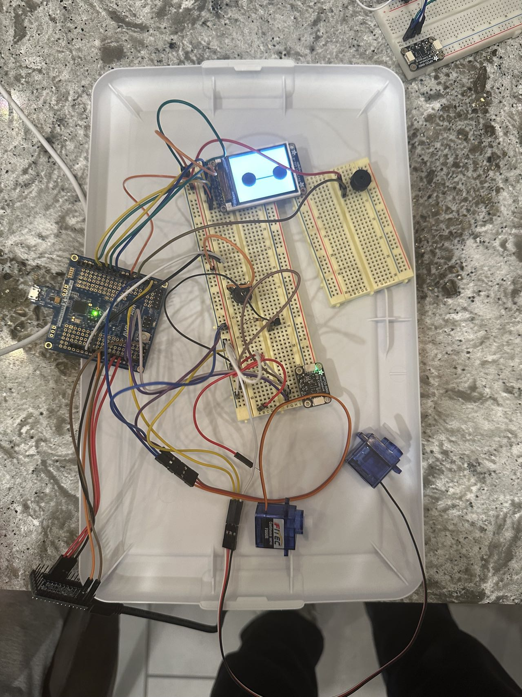

- HRS 02 **[Made it!]**

> A gesture sensor shall communicates with PC via I2C protocal.

- HRS 03 **[Made it!]**

> A gesture sensor shall recognize four gestures: up, down, right, left.

- HRS 04 **[Made it!]**

> A 160x128 resolution LCD shall be used to show the real time, the recognized gesture and wellness reminder.

- HRS 05 **[Made it!]**

> The LCD communicates with MCU via SPI protoccal.

- HRS 06 **[Made it!]**

> Two motors shall be driven by the signal with 50Hz frequency. Motors shall stop under 1.5ms pulse, move clockwisely under 2ms pulse and move counter-clockwisely under 1ms pulse.

- HRS 07 **[Made it!]**

> An HID board shall be used to emulate a PC keyboard, allowing it to send commands to PC via USB D+/D- differential signals.

### 6. Remaining Elements

The 3D-print models of the head, body, arms and base of the electronic pet has been designed, and are awaiting printing and assembly.

.png)

### 7. Device Demo

In this case, four gestures will correspond to four different computer commands, including switching screen, screenshot, opening task manager and opening Chrome. Besides, the buzzer will beep within a time period of 20s in order to improve test efficiency.

The demo video: [V11](https://drive.google.com/file/d/1m-dDR5gsSzl5uwqw9SJPlLUTUPSYQjW5/view?usp=drive_link)

### 8. Risk Assessment

The riskest part remaining of our project is the 3d print model of head, this is because that we are not sure whether it is added to the print queue before the thanksgiving holiday, even though we sent it before the thanksgiving holidays. In order to de-risk this, there are two methods:

1. We will go to RPL to inquire about printing progress. If it cannot be guarantee to finish printing before demonstration day, we will order the printing in the addLab, which guarantees to finish in three days.

2. We can also hang the gesture sensor in front of the forehead of the original robot head and use tape to fix it, although it would be a bit unsightly.

### 9. Questions for the Teaching Team

None

## Sprint review #2

### Current state of project

1. Finalized the idea and the plan for our project. Our team has decided to use a gesture sensor for gesture detection and recognition. In addition, the LCD screen, buzzer, and motors will be added to improve the electronic pet's interaction while connecting to the PC and executing commands.

2. Ordered the required components. We have received 3 components: RTC, flash, servos.

3. Successfully control gesture sensor to recognize four gestures: up, down, left, right.And Successfully control LCD to display icons corresponding to recognized gestures.
> The Image of Water Bottle LCD Display: [Water Bottle](https://drive.google.com/file/d/1hh_OgBJhPmVRHa6c46H9C_8b7qOoGuwS/view?usp=drive_link)

> The Video of LCD Gestures Display: [Gesture Display](https://drive.google.com/file/d/1W2JvqTncnx3lFA_2meEEx73QFCfb7sWc/view?usp=drive_link)

4. Successfully control servo with recognized gestures. 
> The Video of Servo Control: [Servo](https://drive.google.com/file/d/1LNcZPOyx6vkWZDPbLIZvZFlKeurZBs9b/view?usp=drive_link) 

5. Having completed 3D model construction. 
> Arm: 
> Body: 
> Head: 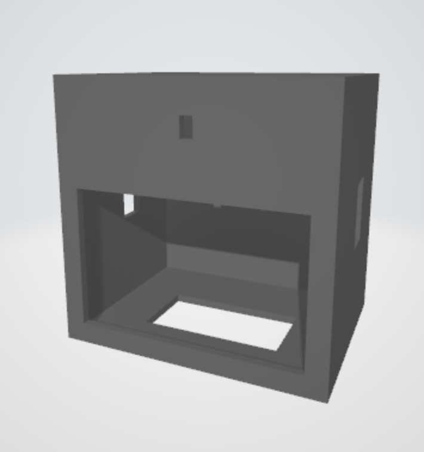
### Last week's progress
Task 1: Having combined gesture sensor with motors together.

Task 2: Having finished 3D model construction.

### Next week's plan
Task 1: 3D print constructed model and finetune the model parameters.

Task 2: Combined all program sections together, including: LCD, servo, buzzer, gesture sensor.

## Sprint review #1

### Current state of project
1. Finalized the idea and the plan for our project. Our team has decided to use a gesture sensor for gesture detection and recognition. In addition, the LCD screen, buzzer, and motors will be added to improve the electronic pet's interaction while connecting to the PC and executing commands.

2. Ordered the required components. We have received 3 components: RTC, flash, servos.

3. Successfully control gesture sensor to recognize four gestures: up, down, left, right.And Successfully control LCD to display icons corresponding to recognized gestures.
> The Image of Water Bottle LCD Display: [Water Bottle](https://drive.google.com/file/d/1hh_OgBJhPmVRHa6c46H9C_8b7qOoGuwS/view?usp=drive_link)

> The Video of LCD Gestures Display: [Gesture Display](https://drive.google.com/file/d/1W2JvqTncnx3lFA_2meEEx73QFCfb7sWc/view?usp=drive_link)

4. Successfully control servos.
> The Video of Servo Control: [Servo](https://drive.google.com/file/d/1H7mHBynziwRYutCvyiZBHaH5_YvIEsiG/view?usp=drive_link) 
### Last week's progress 

Task 1: Complete the programming of the functions for the LCD display. We plan to design some animations on the screen, including:

- Gestures in four directions: up, down, left, and right.
- A reminder to drink water.
- Idle state: displaying the electronic pet's eye.

Task 2: Combine the programming of the gesture sensor and the LCD display. To be specific, when we show different gestures to the sensor, the LCD display can play the corrosponding animations.

Task 3: Complete the programming of the motor control.
### Next week's plan
Task 1: Programming gesture sensor with motors together.

Task 2: Thinking about physical construction of electronic pet writing down with sketch.
## Sprint review trial

### Current state of project

1. Finalized the idea and the plan for our project. Our team has decided to use a gesture sensor for gesture detection and recognition. In addition, the LCD screen, buzzer, and motors will be added to improve the electronic pet's interaction while connecting to the PC and executing commands.

2. Ordered the required components. We have finalized the components needed at this stage, including a gesture sensor, motors, camera board, flash memory, RTC IC, HID board, etc., and have already placed the order.

3. Ready to start. We plan to start our project by programming the gesture sensor and LCD display.

### Last week's progress 

1. We discuss with TA and Professor to get approval for the project. And we modify some parts in project proposal based on the suggestions from TA and professor. To be specific, we modify the contexts of some parts, like system block diagrams, software requirements specification, hardware requirement specification, components and methodology. The commits in github are shown below:

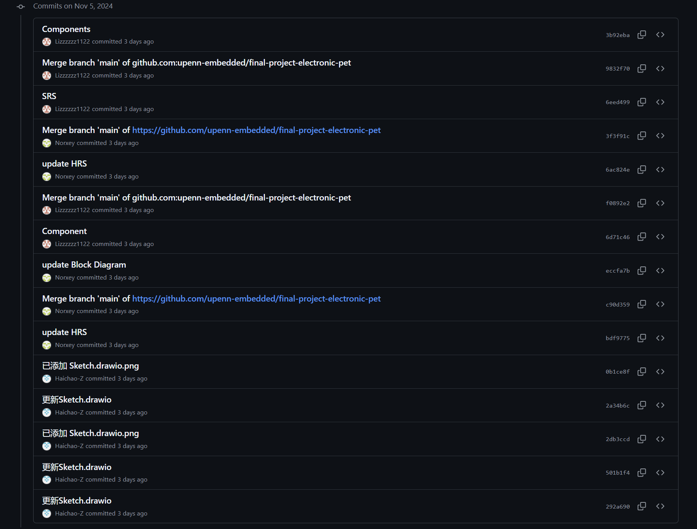

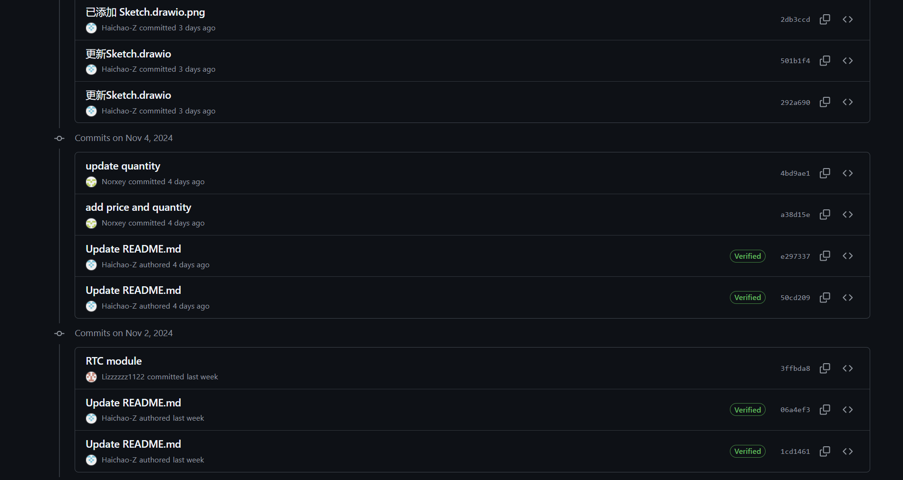

2. We ordered parts based on the components written in the proposal. We have ordered one Flash, one Espressif ESP32-S3-EYE, two Light, Ambient Sensor Evaluation Board, one Real Time Clock, one Adafruit ItsyBitsy 32u4 and two servo motor. Total price is $99.11, which is within the budget. Request forms are shown below:

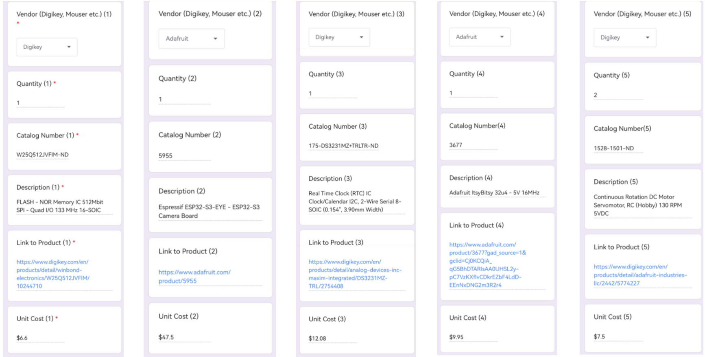

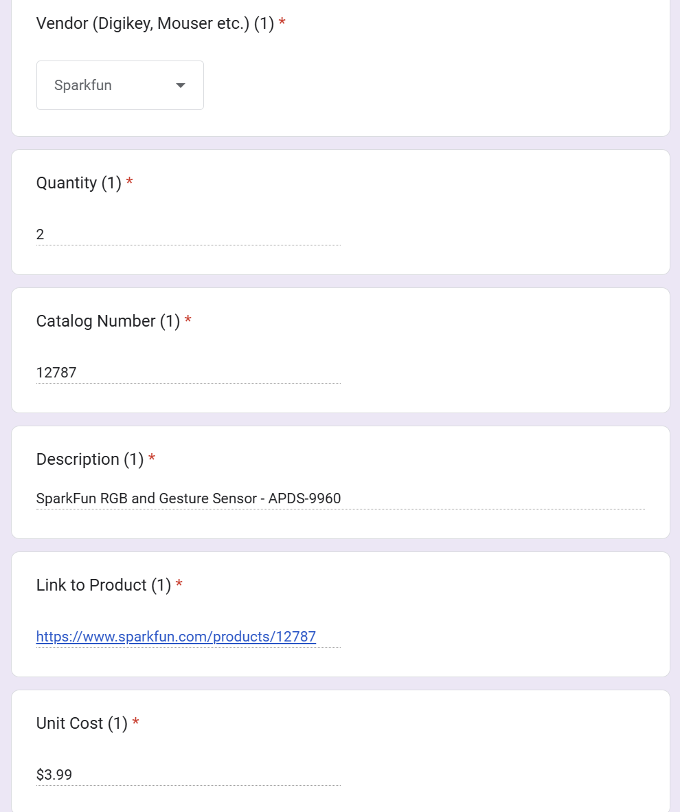

3. We determine the next week plan.

### Next week's plan

1. Complete the programming of the functions for the LCD display. We plan to design some animations on the screen, including:

- Gestures in four directions: up, down, left, and right.
- A reminder to drink water.
- Idle state: displaying the electronic pet's eye.

2. Combine the programming of the gesture sensor and the LCD display. To be specific, when we show different gestures to the sensor, the LCD display can play the corrosponding animations.

3. Complete the programming of the motor control.

## Final Project Proposal

### 1. Abstract

This design features an electronic pet powered by the ATmega328PB microcontroller. The electronic pet can recognize human gestures and translate them into commands to control a personal computer. It provides an intuitive user interface, making computer interaction more engaging and fun.

### 2. Motivation

**Problem to Solve**:

1. Many computer interactions require physical interaction, which can interrupt work or leisure activities. For example, pausing music manually during work or shutting down devices when you are not sitting in front of computer.
2. When people did a lot of works on the computer, he may feel quite boring. At that time, this product can be not only entertaining, but also useful. Natural interaction mechanisms like gesture recognition would make the experience more immersive and fun.
3. Users with disabilities or mobility restrictions often find conventional computer input devices difficult to use. A gesture-based control system offers a more accessible and intuitive way for them to interact with technology.

**Why is Interesting**:

1. This project turn everyday computer tasks into fun, interactive experiences.
2. Different users has different requirements. Users can customize the robot's responses and create personalized control gestures for essential tasks.
3. This project can act as a prototype for future consumer devices and it can be used in a wide variety field in the future.

**Intended Purpose**:

1. Firstly, create an interactive electronic pet that provides both fun and practical functions.
2. Secondly, the project aims to make computer more intuitive by removing the need for physical contact, ensuring tasks can be managed effortlessly, even when users are busy or away from the computer.

### 3. Goals

We aim at building an electronic pet with LCD based on one hand gesture recognition which has following basic functions:
> Capture 4 basic hand gestures with wireness camera:
>> Wave one hand towards left

>> Wave one hand towards right

>> Move up one hand

>> Move down one hand

> MCU control PC to complete specific tasks corresponding to hand gestures

> LCD displays recognized hand gesture and hydration reminders with animations

> Buzzer sounds when timer reaches the set time

### 4. System Block Diagram

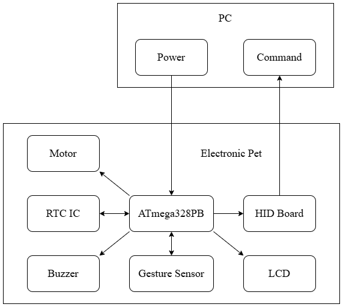

### 5. Design Sketches

### 6. Software Requirements Specification (SRS)

#### 6.1 Overview

The project is an interactive electronic pet system transforms routine computer interactions into engaging, hands-free experiences. Using camera-based gesture recognition with an LCD display interface. The solution particularly benefits users with mobility restrictions and those seeking more natural computer interactions during work or leisure activities.

#### 6.2 Users

Primary users of this project include:

- Busy professionals who need hands-free computer control while multitasking
- Users with mobility restrictions or disabilities who find traditional input devices challenging
- Technology enthusiasts interested in innovative human-computer interaction
- Individuals seeking a more engaging and entertaining way to interact with their computers
- Users who want a customizable, personal assistant for computer control

#### 6.3 Definitions, Abbreviations

- MCU: Microcontroller Unit
- LCD: Liquid Crystal Display
- UART: Universal Asynchronous Receiver / Transmitter
- USB: Universal Serial Bus
- SPI: Serial Peripheral Interface
- PWM: Pulse Width Modulation

#### 6.4 Functionality

SRS 01 - The system shall shutdown PC when the hand stops over the gesture sensor.

SRS 02 - The system shall launch Spotify when the gesture sensor detects the moving up hand.

SRS 03 - The system shall switch PC screen when the gesture sensor detects the moving right hand.

SRS 04 - The LCD shall display animated responses to user gestures.

SRS 05 - The LCD shall display wellness reminder animations.

SRS 06 - The LCD shall display animations when the system is in idle state.

SRS 07 - The system shall have maximum 200ms gesture recognition latency.

SRS 08 - The system shall have 90% minimum recognition accuracy.

SRS 09 - The system shall have stable USB connectivity at 115200 baud rate.

### 7. Hardware Requirements Specification (HRS)

#### 7.1 Overview

When the electronic pet captures the user's gesture through the camera, the controller communicates with the PC to execute the corresponding command and displays the result on the LCD screen. When the user has been using the device for a certain amount of time, the electronic pet will give a health reminder through the LCD screen and buzzer.

#### 7.2 Definitions, Abbreviations

- PC: Personal Computer
- LCD: Liquid Crystal Display
- RTC: Real Time Clock
- IC: Integrated Circuit
- HID: Human Interface Device

#### 7.3 Functionality

HRS 01 - The electronic pet shall be connected to the PC through a wired connection, which is used for both power supply and serial communication.

HRS 02 - A gesture sensor shall be used for gesture capture and should identify six types of gestures: up, down, left, right, approach and retreat.

HRS 03 - A LCD display shall be used to show the real time, the recognized gesture and wellness reminder.

HRS 04 - A buzzer shall be used as an alarm to remind the user of the device usage time.

HRS 05 - A RTC IC should be used to show the real time on the LCD display.

HRS 06 - Two motors shall be used to control the robot's both arms. When the gesture sensor recognizes an upward or downward gesture, the motors should control the arms to move up or down accordingly.

HRS 07 - An HID board shall be used to emulate a PC keyboard, allowing it to execute PC commands. Based on the recognized gestures, the HID board should perform functions on PC, including playing music on PC and shut down the PC.

HRS 08 - When music is playing, the motor should control the arms to "dance" along with the music for a while.

HRS 09 - A camera should be an alternative method to explore the possibility of recognizing gestures.

### 8. Components

| Component | Type | Quantity | Cost | Digikey Part Number | MPN | Package | Link |
| :--: | :---: | :------: | :--: |  :--: |  :--: | :------: | :--: |
| Flash | SMD | 1 | $6.60 | W25Q512JVFIM-ND | W25Q512JVFIM | 16-SOIC (0.295", 7.50mm Width) | [Link(Digikey)](https://www.digikey.com/en/products/detail/winbond-electronics/W25Q512JVFIM/10244710) |
| Espressif ESP32-S3-EYE | \  | 1 | $47.50 | \ | \ | \ | [Link(Adafruit)](https://www.adafruit.com/product/5955) |
|  Light, Ambient Sensor Evaluation Board | \ | 2 | $33.00 | 1568-1131-ND | SEN-12787 | \ | [Link(Digikey)](https://www.digikey.com/en/products/detail/sparkfun-electronics/SEN-12787/5623214)  [Link(SparkFun)](https://www.sparkfun.com/products/12787) |
|  Real Time Clock| SMD | 1 | $12.08 | 175-DS3231MZ+TRLTR-ND | DS3231MZ+TRL | 8-SOIC (0.154", 3.90mm Width) | [Link(Digikey)](https://www.digikey.com/en/products/detail/analog-devices-inc-maxim-integrated/DS3231MZ-TRL/2754408) |
| Adafruit ItsyBitsy 32u4 - 5V 16MHz | \ | 1 | $9.95 | \ | \ | \ | [Link(Adafruit)](https://www.adafruit.com/product/3677?gad_source=1&gclid=Cj0KCQiA_qG5BhDTARIsAA0UHSL2y-pC7VzKXfIvCDkrEZbF4LdD-EEnNxDNG2m3R2r4) |
| Servo Motor | \ | 2 | $15 | 1528-1501-ND | 2442 | \ | [Link(Digikey)](https://www.digikey.com/en/products/detail/adafruit-industries-llc/2442/5774227) |
| UCAM-III | CMOS | 1 | $54.95 | 1613-1369-ND | UCAM-III | Module | [Link(Digikey)](https://www.digikey.com/en/products/detail/4d-systems-pty-ltd/UCAM-III/6623663)  [Link(Description)](https://resources.4dsystems.com.au/datasheets/accessories/uCAM-III/#troubleshooting)(No need to order right now, maybe need it later) |

Others (No need to order):

ATmega328PB - <https://www.microchip.com/en-us/product/atmega328pb#document-table>

LCD - <https://www.adafruit.com/product/358>

buzzer - <https://www.adafruit.com/product/160>

3D-Printing Box

### 10. Final Demo

In the final demostration, a robot will be shown. It is connected to PC. When PC is turned on, robot is powered on, then camera and LCD on it will also be powered on. After that, we will show some different gestures in front of the camera and it will identify which gesture we show. After it identifies gesture successfully, the LCD will show the gesture identified. Then, MCU will send command to PC according to the information it received from the camera and PC will execute that command. For example, if a scissor pose represents opening a music program on PC. When camera identifies it, LCD will show a figure of a scissor pose and PC will open the music program. What is more, the robot also has the function of wellness reminder. To be specific, it will beep at preset intervals. In the final demo, we will show different gestures and at the same time PC will execute different command, like turning off PC, opening a program, capturing an image and so on.

### 10. Methodology

1. PC powers on MCU, LCD, camera and buzzer.
2. Camera uses UART to send back the information of gesture to the MCU.
3. Deep Learning Models(ResNet Model and FCNN) are used to identify the gesture.
4. MCU uses UART to send command to the PC.
5. Timer and interrupt is used to beep buzzer.
6. Using the preset function in the LCD to draw figure.

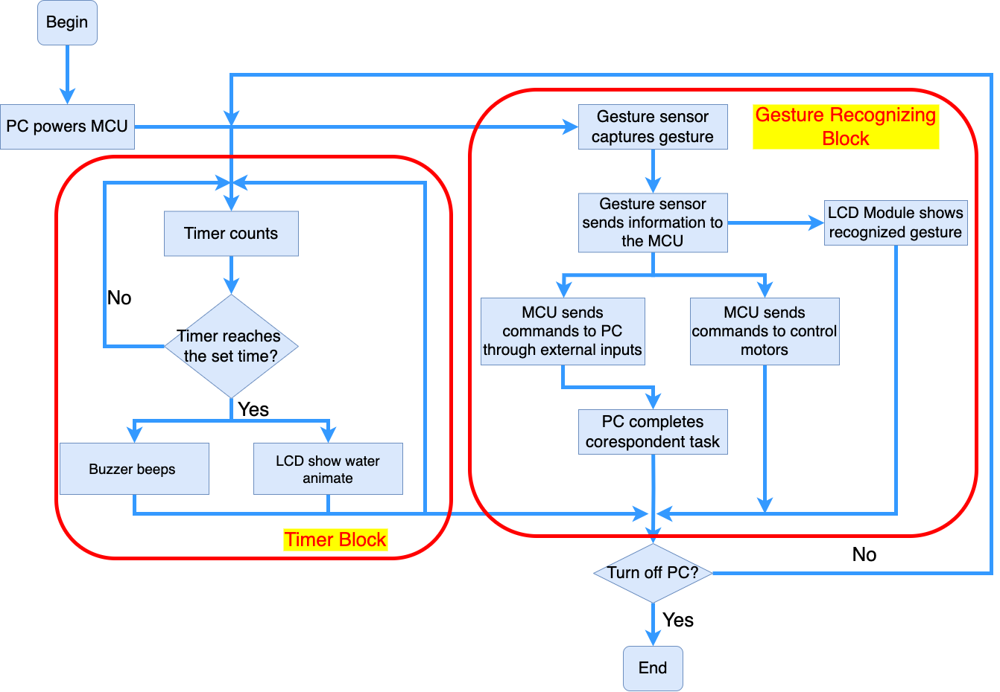

### 10. Evaluation

1. According to the figure identified, LCD on the robot will show the same figure.
2. According to the figure identified, PC will execute different command and no one gesture will produce the same command. For example, if a scissor pose is shown, PC may open a program.
3. Buzzer will beep at preset intervals to be a wellness reminder. Time interval can be set to 1 hour or 2 hours.

### 12. Proposal Presentation

Add your slides to the Final Project Proposal slide deck in the Google Drive.

## References

Fill in your references here as you work on your proposal and final submission. Describe any libraries used here.

## Github Repo Submission Resources

You can remove this section if you don't need these references.

* [ESE5160 Example Repo Submission](https://github.com/ese5160/example-repository-submission)
* [Markdown Guide: Basic Syntax](https://www.markdownguide.org/basic-syntax/)
* [Adobe free video to gif converter](https://www.adobe.com/express/feature/video/convert/video-to-gif)
* [Curated list of example READMEs](https://github.com/matiassingers/awesome-readme)
* [VS Code](https://code.visualstudio.com/) is heavily recommended to develop code and handle Git commits
  * Code formatting and extension recommendation files come with this repository.
  * Ctrl+Shift+V will render the README.md (maybe not the images though)
