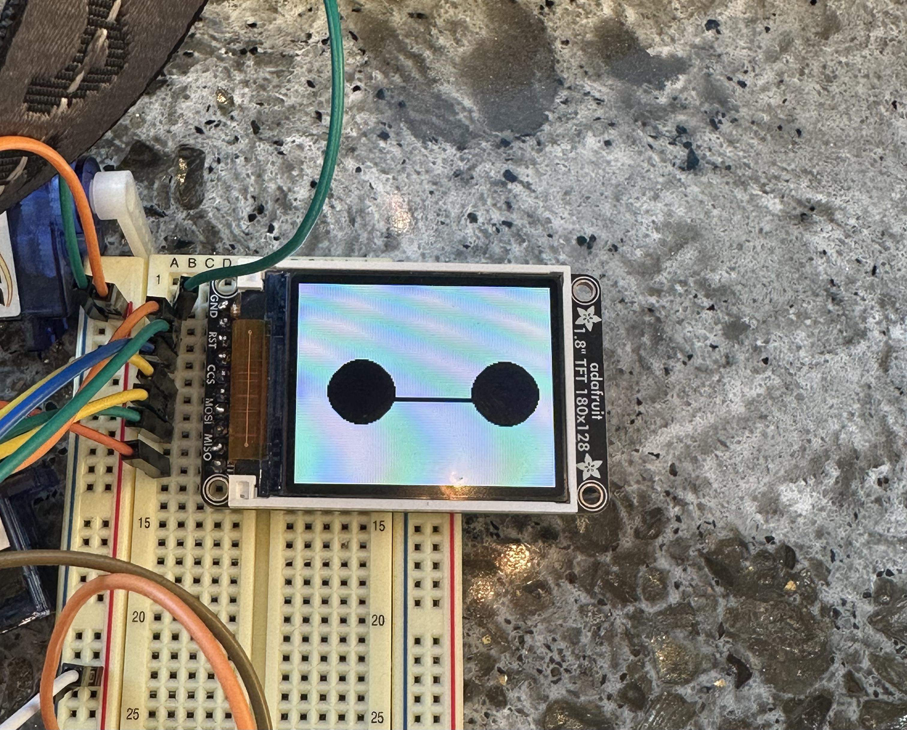
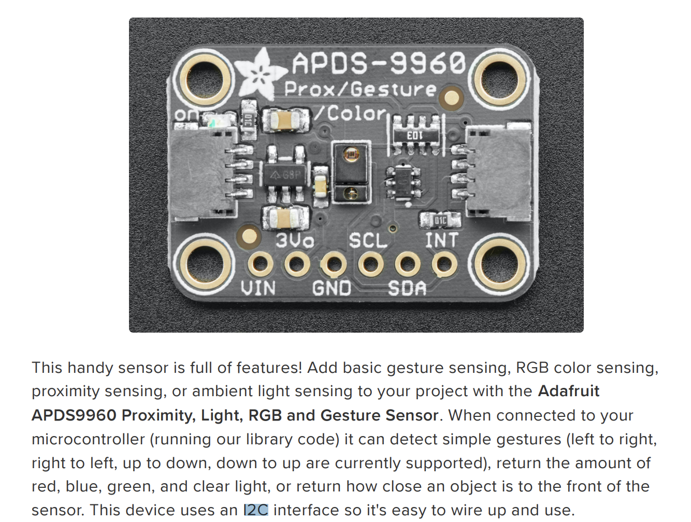
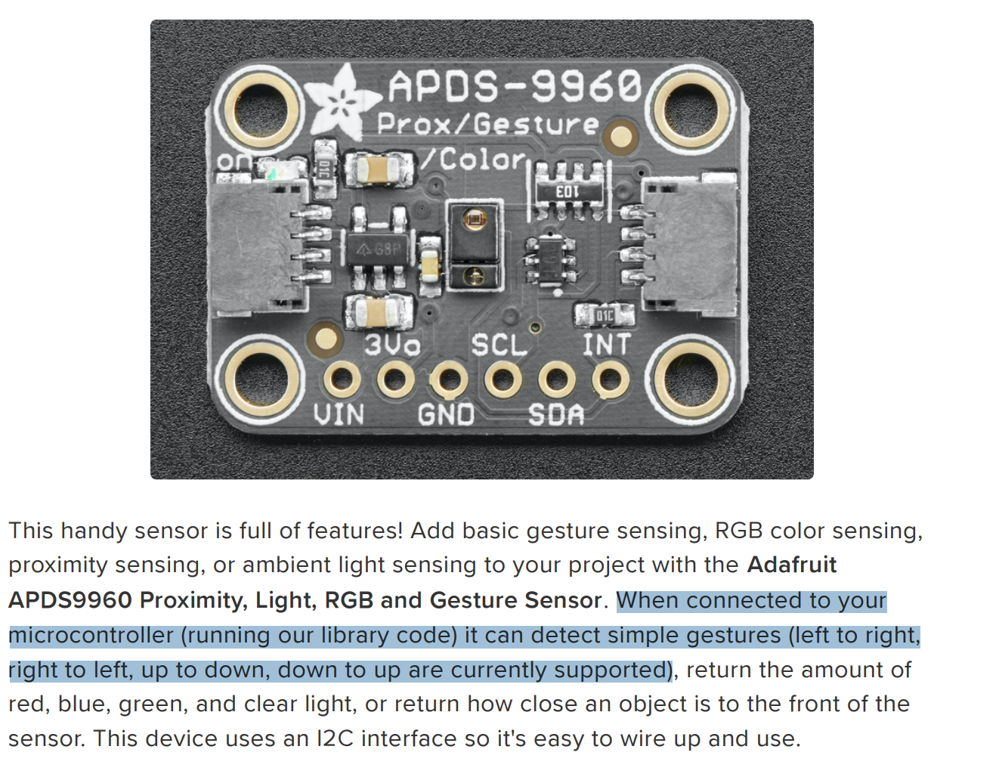
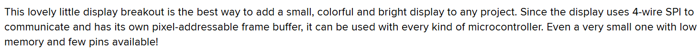
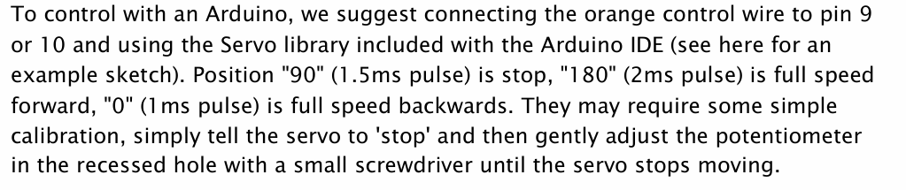
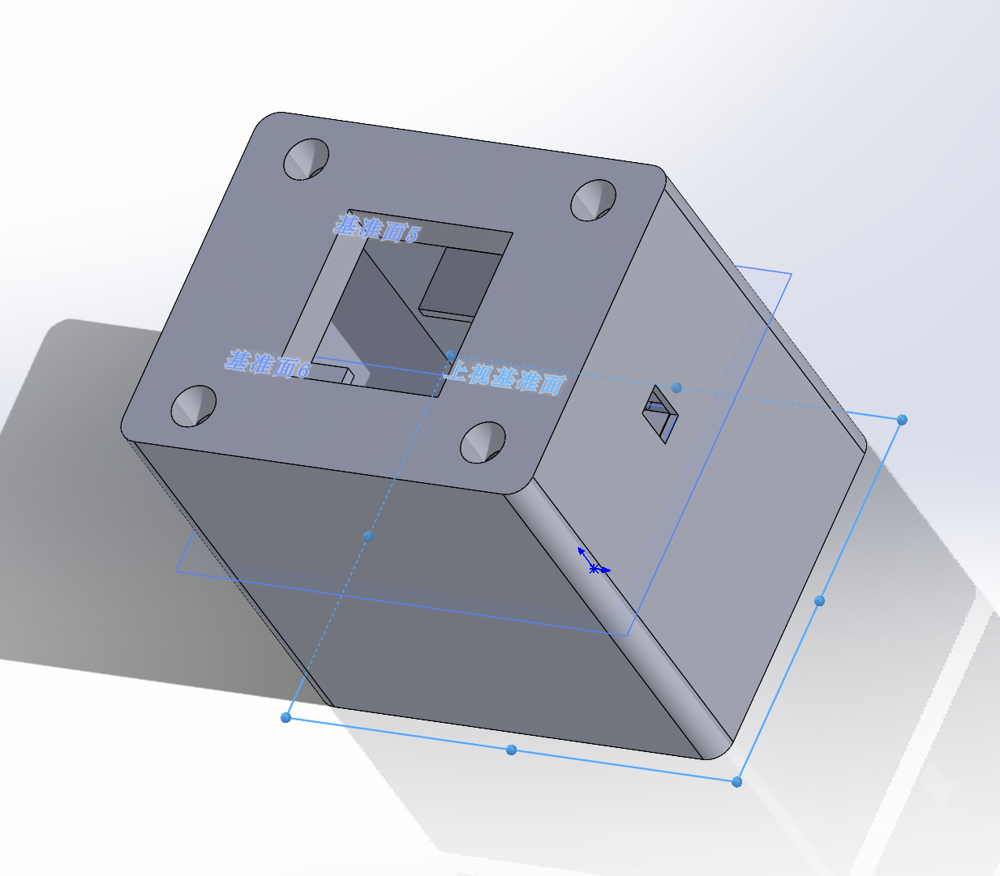
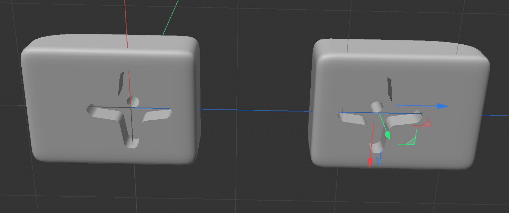

## MVP Demo

### 1. System Block Diagram

### 2. Hardware Implementation

1. **MCU**: The ATmega328PB MCU controls all other modules and provides power to them.

2. **Gesture sensor**: The gesture sensor utilizes four directional photodiodes to sense reflected IR energy (sourced by the integrated LED) to convert a physical motion to a digital information.

3. **LCD screen**: The LCD screen displays animations to enhance interaction between users and the electronic pet.

4. **Servo motor**: Two servo motors control the raising and lowering of the electronic pet's arms (it can dance!).

5. **Buzzer**: The buzzer is used for notifications during successful interactions. The driving circuit of the buzzer includes a transistor and a resistor.

6. **HID board**: Through the HID board, the electronic pet can send commands to the computer to perform certain operations.

### 3. Firmware Implementation

1. **Gesture sensor**:

- Communicates with the MCU via I2C.

- Recognizes gestures moving in four directions: up, down, left, and right.

> Different movement directions cause the four directional photodiodes to receive different reflected IR energy, which is then converted into digital signals stored in registers. By evaluating the values from the four directions, the movement direction of the gesture can be identified.

2. **LCD screen**:

- Communicates with the MCU via SPI.

- Detection Prompt: When a gesture movement is successfully detected, it displays an arrow corresponding to the movement direction (up, down, left, or right).

- Health Reminder: When the user has been using the device for a certain time, it shows a water cup icon to remind them to drink water and take a break.

- Idle State: Displays the electronic pet’s cute eyes.

3. **Servo motor**

- Set PD0 and PD1 as outputs

- Using timer 3 and timer 4, set the Fast PWM mode and 64 prescaler and set the value of ICR to 4999, which outputs 50Hz frequency. FS90R servo motors need to operate under 50Hz frequency.

- According to the datasheet, FS90R servo rotates clockwisely when it works under 2ms. It stops when it works under 1.5ms and it rotates counter-clockwisely when it works under 1ms. Therefore, OCnA (n=3 & 4) is set to 250,365 and 499 for control the rotation of servo.

- Owing to the fact that FS90R servo is a continuous servo, the position of the servo is controlled by the time it rotates. Thus, delay function is used in this part.

4. **Buzzer**

- Set PD3 as an output

- Using timer 2, set Fast PWM mode to control the volumn of buzzer and use timer prescaler to adjust the frequency of Buzzer to nearly 1kHz, which is comfortable for users to hear.

- Enable the overflow for timer 2. And after each time overflows, a preset time flag will be added one. Only when it gets the preset value (the time we expect to beep), the buzzer will beep for a second, which is operated in the main function.

5. **HID board**

- Communicates with PC via USB D+/D- differential signals, given flag signals received from MCU.

- When the recognized gesture is down, HID board will open google Chrome application installed in the MAC.

- When the recognized gesture is right, HID board will switch the screen of the PC.

### 4. Software Requirements Specification (SRS)

- SRS 01 **[Made it!]**

> The system shall do the task of screenshot when the gesture sensor detects the moving up hand.

The link of video display is:[V1](https://drive.google.com/file/d/1fkpihpQ44amjBUFiKkw18MEKBuSZ3KU-/view?usp=drive_link)

- SRS 02 **[Made it!]**

> The system shall launch google Chrome when the gesture sensor detects the moving down hand.

The link of video display is:[V2](https://drive.google.com/file/d/1Wh1JHAG3Pr6LVd0mXqYp__kRukJqDz1s/view?usp=drive_link)

- SRS 03 **[Made it!]**

> The system shall switch PC screen when the gesture sensor detects the moving right hand.

The link of video display is:[V3](https://drive.google.com/file/d/1EapzakLrTIgx123OXrF2mTiJWEVJ3b9T/view?usp=drive_link)

- SRS 04 **[Made it!]**

> The system shall open the task manager when the gesture sensor detects the moving left hand.

The link of video display is:[V4](https://drive.google.com/file/d/1xH8n1ZiWqEgTUIaBlixUrCzzgj85gfq1/view?usp=drive_link)

- SRS 05 **[Made it!]**

> The LCD shall display down arrow.

- SRS 06 **[Made it!]**

> The LCD shall display up arrow.

- SRS 07 **[Made it!]**

> The LCD shall display right arrow.

- SRS 08 **[Made it!]**

> The LCD shall display left arrow.

- SRS 09 **[Made it!]**

> The LCD shall display animations when the system is in idle state.

- SRS 10 **[Made it!]**

> The LCD shall display animated responses to user gestures.

The link of display video is: [V5](https://drive.google.com/file/d/1IOBCJcWFccStGwdMlVPXu7W4NL4uqNJs/view?usp=drive_link).

- SRS 11 **[Made it!]**

> The LCD shall display wellness reminder animations. And in this case, we set time period is 10s to improve test efficiency. To be specific, buzzer shall beep within this time period and a wellness reminder animation will be displayed.

The link of display video is: [V6](https://drive.google.com/file/d/1-ddZrnf8HIaAwiVmv1yV4MZT98EUigUu/view?usp=drive_link).

- SRS 12 **[Made it!]**

> When the gesture sensor detects a hand movement to left, the left arm of the robot shall raise upwards and lowered after a period of time. The right arm shall stay still.

The link of display video is: [V7](https://drive.google.com/file/d/1mLXMoj3JGx8evmCGHVzJQdQ7xlr-j9_C/view?usp=drive_link).

- SRS 13 **[Made it!]**

> When the gesture sensor detects a hand movement to right, the right arm of the robot shall raise upwards and lowered after a period of time. The left arm shall stay still.

The link of display video is: [V8](https://drive.google.com/file/d/1ahBXgcYvGRqWWBL1ar0cll6QrIZncVmL/view?usp=drive_link).

- SRS 14 **[Made it!]**

> When the gesture sensor detects a hand movement to up, both the left arm and the right arm of the robot shall raise upwards for a long distance and lowered after a period of time.

The link of display video is: [V9](https://drive.google.com/file/d/1C2JQ0_Hdg2LdXJzhIfmaxhJmGpWxYvA6/view?usp=drive_link).

- SRS 15 **[Made it!]**

> When the gesture sensor detects a hand movement to down, both the left arm and the right arm of the robot shall raise upwards for a short distance and lowered after a period of time.
The link of display video is: [V10](https://drive.google.com/file/d/19ImU_UHjelTiXKCMLaanyTp2y1ZOPTpi/view?usp=drive_link).

### 5. Hardware Requirements Specification (HRS)

- HRS 01 **[Made it!]**

> The electronic pet shall be connected to the PC through a wired connection, which is used for both power supply and USB communication.

- HRS 02 **[Made it!]**

> A gesture sensor shall communicates with PC via I2C protocal.

- HRS 03 **[Made it!]**

> A gesture sensor shall recognize four gestures: up, down, right, left.

- HRS 04 **[Made it!]**

> A 160x128 resolution LCD shall be used to show the real time, the recognized gesture and wellness reminder.

- HRS 05 **[Made it!]**

> The LCD communicates with MCU via SPI protoccal.

- HRS 06 **[Made it!]**

> Two motors shall be driven by the signal with 50Hz frequency. Motors shall stop under 1.5ms pulse, move clockwisely under 2ms pulse and move counter-clockwisely under 1ms pulse.

- HRS 07 **[Made it!]**

> An HID board shall be used to emulate a PC keyboard, allowing it to send commands to PC via USB D+/D- differential signals.

### 6. Remaining Elements

The 3D-print models of the head, body, arms and base of the electronic pet has been designed, and are awaiting printing and assembly.

Overview:

Head:

Body：

Arms:

### 7. Device Demo

In this case, four gestures will correspond to four different computer commands, including switching screen, screenshot, opening task manager and opening Chrome. Besides, the buzzer will beep within a time period of 20s in order to improve test efficiency.

The demo video: [V11](https://drive.google.com/file/d/1m-dDR5gsSzl5uwqw9SJPlLUTUPSYQjW5/view?usp=drive_link)

### 8. Risk Assessment

The riskest part remaining of our project is the 3d print model of head, this is because that we are not sure whether it is added to the print queue before the thanksgiving holiday, even though we sent it before the thanksgiving holidays. In order to de-risk this, there are two methods:

1. We will go to RPL to inquire about printing progress. If it cannot be guarantee to finish printing before demonstration day, we will order the printing in the addLab, which guarantees to finish in three days.

2. We can also hang the gesture sensor in front of the forehead of the original robot head and use tape to fix it, although it would be a bit unsightly.

### 9. Questions for the Teaching Team

None